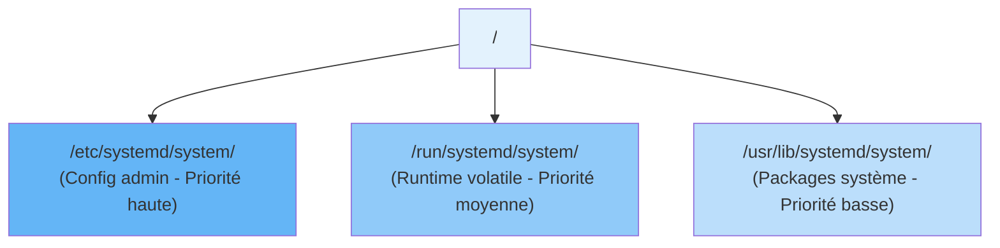
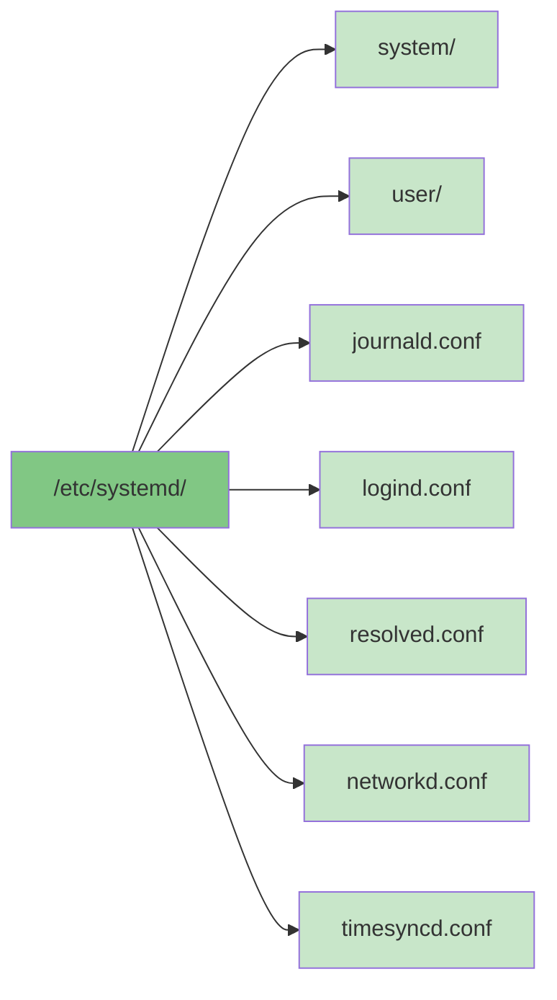
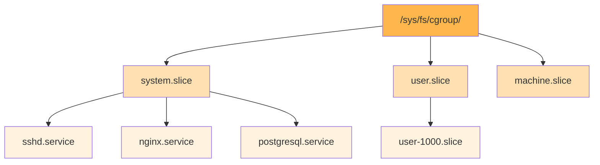
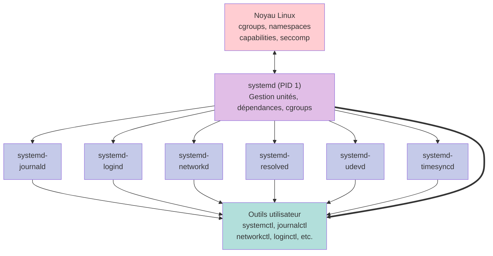

# Architecture de systemd

systemd suit une architecture modulaire où le daemon principal (PID 1) coordonne un ensemble de composants spécialisés. Cette conception permet une séparation claire des responsabilités tout en maintenant une intégration étroite entre les différents services système.

## Le daemon principal : systemd (PID 1)

Le processus systemd s'exécute avec le PID 1, ce qui en fait le premier processus lancé par le noyau Linux après le boot. Il est le parent direct ou indirect de tous les autres processus du système.

### Responsabilités principales

- **Initialisation du système** : Montage des systèmes de fichiers, configuration réseau de base
- **Gestion des unités** : Chargement, démarrage, arrêt et supervision des unités
- **Gestion des dépendances** : Résolution de l'ordre de démarrage basé sur les dépendances
- **Supervision des processus** : Surveillance et redémarrage automatique des services
- **Gestion des cgroups** : Organisation hiérarchique des processus

### Communication avec systemd

Les utilisateurs et programmes interagissent avec systemd principalement via :

- **D-Bus** : Interface de communication inter-processus pour les commandes et événements
- **systemctl** : Interface en ligne de commande principale
- **API socket** : Pour les applications nécessitant une intégration profonde

## Composants de l'écosystème

### systemd-journald

Le daemon de journalisation collecte et stocke les logs du système.

**Fonctionnalités** :

- Stockage binaire structuré avec métadonnées
- Indexation pour recherche rapide
- Rotation automatique des logs
- Forward vers syslog si nécessaire
- Collecte des logs kernel, services et applications

**Fichiers de configuration** : `/etc/systemd/journald.conf`

### systemd-logind

Gère les sessions utilisateur et les sièges (seats) multi-utilisateurs.

**Fonctionnalités** :

- Suivi des sessions utilisateur
- Gestion de l'alimentation (suspend, hibernate)
- Contrôle d'accès aux périphériques
- Support multi-seat

**Commande associée** : `loginctl`

### systemd-udevd

Gère les événements des périphériques matériels.

**Fonctionnalités** :

- Détection dynamique du matériel
- Chargement automatique des modules kernel
- Création des nœuds de périphériques dans `/dev`
- Application de règles udev personnalisées

**Répertoire de règles** : `/etc/udev/rules.d/`, `/lib/udev/rules.d/`

### systemd-networkd

Daemon de gestion réseau pour la configuration des interfaces.

**Fonctionnalités** :

- Configuration des interfaces réseau
- Support DHCP client et serveur
- Configuration de VLAN, bridges, bonds
- Routage statique

**Fichiers de configuration** : `/etc/systemd/network/*.network`

**Commande associée** : `networkctl`

### systemd-resolved

Service de résolution DNS avec cache intégré.

**Fonctionnalités** :

- Résolution DNS avec cache
- Support DNSSEC
- Support mDNS et LLMNR
- Intégration avec systemd-networkd

**Fichiers de configuration** : `/etc/systemd/resolved.conf`

**Commandes associées** : `resolvectl`, `systemd-resolve`

### systemd-timesyncd

Client SNTP léger pour la synchronisation horaire.

**Fonctionnalités** :

- Synchronisation NTP basique
- Alternative légère à ntpd/chrony
- Stockage du temps dans `/var/lib/systemd/timesync/`

**Fichiers de configuration** : `/etc/systemd/timesyncd.conf`

**Commande associée** : `timedatectl`

### systemd-boot (anciennement gummiboot)

Gestionnaire de démarrage UEFI simple.

**Fonctionnalités** :

- Boot sur systèmes UEFI
- Interface minimale
- Configuration simple

**Commande associée** : `bootctl`

## Hiérarchie des répertoires

systemd utilise une structure de répertoires bien définie :

### Fichiers d'unités



**Ordre de priorité** : `/etc` > `/run` > `/usr/lib`

### Configuration



### Données runtime

```text
/run/systemd/
  ├── system/                 # État runtime du système
  ├── sessions/               # Sessions utilisateur actives
  └── units/                  # État des unités
```

### Données persistantes

```text
/var/lib/systemd/
  ├── catalog/                # Catalogues de messages du journal
  ├── coredump/               # Core dumps des applications
  └── timesync/               # Données de synchronisation horaire
```

## Gestion des cgroups

systemd organise tous les processus dans une hiérarchie de cgroups (control groups) qui permet de :

- Limiter les ressources (CPU, mémoire, I/O)
- Mesurer l'utilisation des ressources
- Isoler les processus
- Tuer tous les processus d'un service de manière fiable

### Hiérarchie typique



Chaque service systemd s'exécute dans son propre cgroup, permettant une isolation et un contrôle précis.

## Communication D-Bus

systemd utilise intensivement D-Bus pour la communication inter-processus.

### Bus système

Le bus D-Bus système permet :

- L'envoi de commandes à systemd
- La notification d'événements système
- L'intégration avec d'autres services système

### Activation par bus

Les services peuvent être activés automatiquement lors d'une requête D-Bus, permettant un démarrage à la demande.

## Intégration kernel

systemd s'appuie sur plusieurs fonctionnalités du noyau Linux :

- **cgroups v2** : Organisation et limitation des ressources
- **namespaces** : Isolation des processus
- **capabilities** : Privilèges granulaires
- **seccomp** : Filtrage des appels système
- **autofs** : Montage automatique
- **fanotify/inotify** : Surveillance du système de fichiers

## Schéma d'ensemble



Cette architecture modulaire et intégrée fait de systemd un système d'initialisation puissant et flexible, capable de gérer tous les aspects du cycle de vie d'un système Linux moderne.
